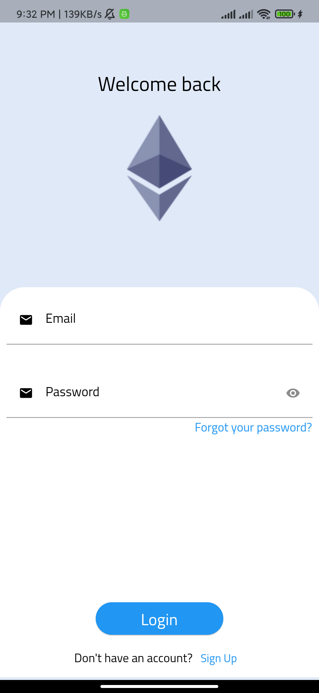
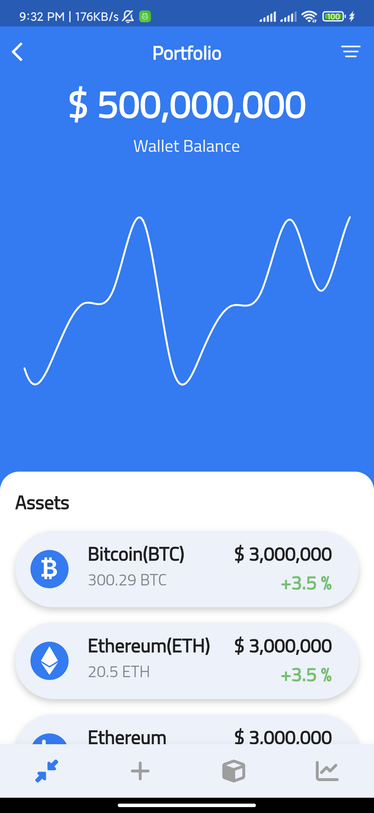

# EtherWALL

A crypto wallet UI kit

## First things first

UI inspired from https://whollet.io/

## Uses Material 3

Made with Flutter 3 ❤️

## Watch Live on https://etherwall.netlify.app/

Although it is not built for web , still you can have a look how the app looks like without running on your device .
I'd prefer to use it on chrome with Any mobile device selected on devtools.

# Screens

# I'm using this portion of readme as checkpoint

# I'll be updating this as soon as I make a new screen

## Welcome Screen

## Login Screen

## Portfolio Screen

## Market Screen (Working on it )

